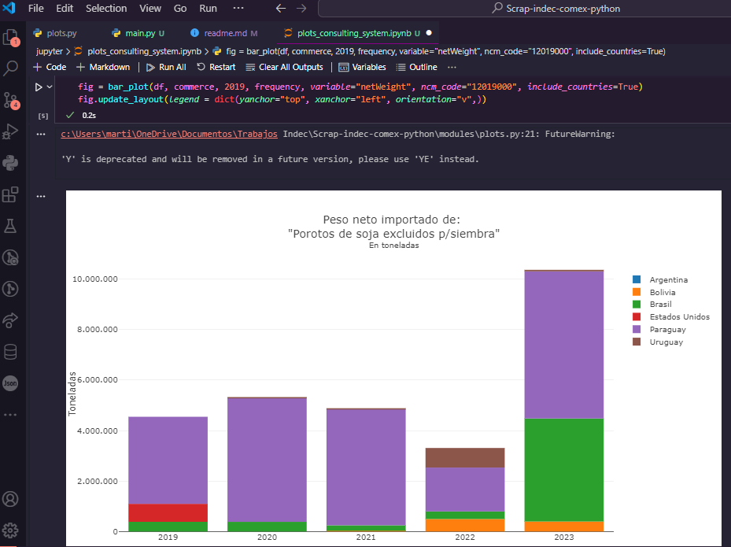

# INDEC Foreign Trade Web Scraping Project

This project focuses on scraping data from the INDEC's foreign trade webpages to collect information on foreign trade indexes, as well as CIF, FOB, netWeight, Freight, and Insurance values for foreign trade. The scraped data can be used for analysis and visualization.

## Table of Contents

- [Introduction](#introduction)
- [Data Sources](#data-sources)
- [Scraped Data](#scraped-data)
- [Usage](#usage)
- [Jupyter Notebooks](#jupyter-notebooks)
- [Dependencies](#dependencies)
- [License](#license)

## Introduction

The INDEC Foreign Trade Web Scraping Project aims to automate the process of gathering data related to foreign trade from the INDEC website. This is achieved by scraping relevant information from two main sources: foreign trade indexes and detailed trade data.

## Data Sources

- Foreign Trade Indexes: [INDEC Foreign Trade Indexes](https://www.indec.gob.ar/indec/web/Nivel3-Tema-3-2)
- Detailed Trade Data: [INDEC Foreign Trade Database](https://comex.indec.gob.ar/?_ga=2.24363379.850988609.1712010783-1435233005.1689265394#/database)

## Scraped Data

The following data is scraped from the INDEC's foreign trade webpages:

- Foreign Trade Indexes
- CIF (Cost, Insurance, and Freight) values
- FOB (Free on Board) values
- Net Weight
- Freight values
- Insurance values

## Usage

To utilize the scraped data, you can run the provided Jupyter notebooks located in the "jupyter" folder. Additionally, you can use the generated pickle file written by the `main.py` script.

## Jupyter Notebooks

The "jupyter" folder contains Jupyter notebooks for data analysis and visualization. These notebooks demonstrate how to load and manipulate the scraped data for various analytical purposes.



## Dependencies

This project requires the following dependencies:

- Python 3
- BeautifulSoup (for web scraping)
- Pandas (for data manipulation)
- Matplotlib (for data visualization)
- Jupyter (for running the provided notebooks)

You can install the required dependencies using pip:

```
pip install -r requirements.txt
```

## License

This project is licensed under the [MIT License](LICENSE).
